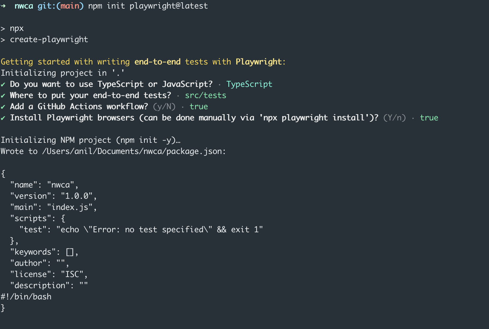
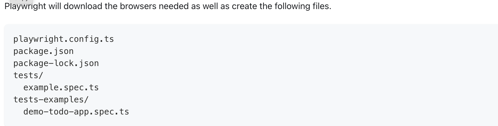
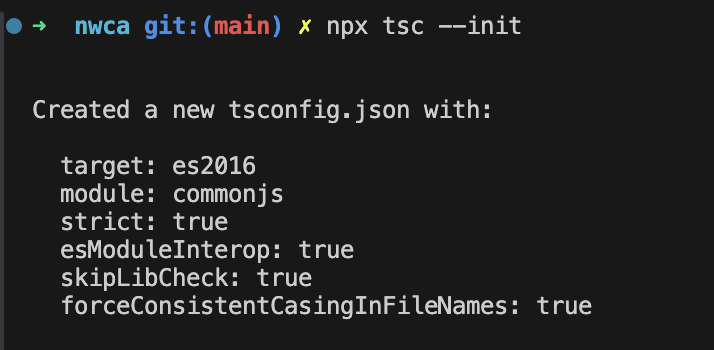
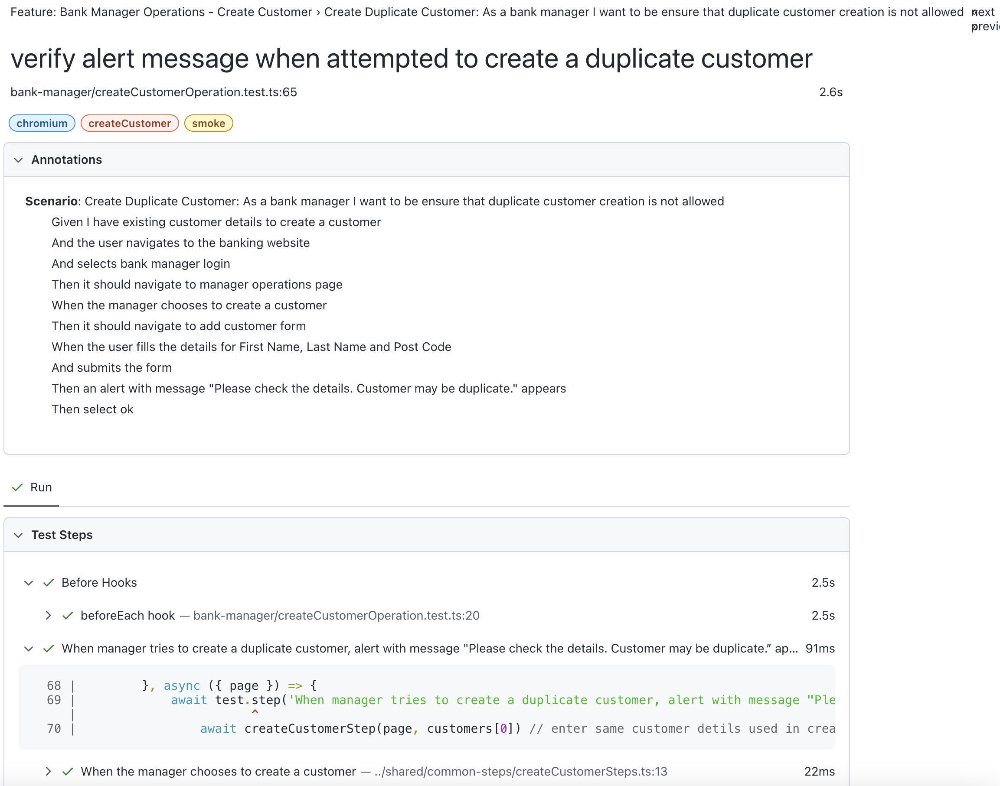

# Playwright Getting started
## Setup: Run the below command to setup playwright and follow the instructions
```
npm init playwright@latest
```

NOTE: Refer to Playwright docs : https://playwright.dev/docs/intro

## What is Installed:


## Setup ts.config file
```
npx tsc --init
```



Note : Change the target to es2024 or your desired version

## How to run the tests in the project
### Install Dependencies: 
```npm i```

### Run all tests parallel in Chrome, Firefox, Safari
```
npm run test
```

### Check lint issues
```
npm run lint
```

### Debugging Tools:
Launch code gen:
```
npm run test:codegen
```
### Launch UI mode:
```
npm run test:ui
```
### Launch codegen
```
npm run test:codegen
```

### Reports
```
npm run generate:reports
npm run show:reports
```

### Logging
```
import { createLogger } from "@/utils/logger/logger"
const logger = createLogger("name-of-page")
logger.info("Can be configured via .env file using doenv")
```
### For more scripts:
Please refer to package.json scripts section

### Path mapping for module resolution in tsconfig.json
```
"paths": {
      "@/messages/*": ["./src/shared/messages/*.ts"],
      "@/types/*": ["./src/shared/types/*"],
      "@/features/*": ["./src/features/customer/*", "./src/features/bank-manager/*"],
      "@/models/*": ["./src/models/*"],
      "@/utils/logger/*": ["./src/utils/logger/*"],
      "@/utils/*": ["./src/utils/*"],
      "@/shared/test-data/*": ["./src/shared/test-data/*"],
      "@/shared/steps/*": ["./src/shared/common-steps/*"],
    }
```


